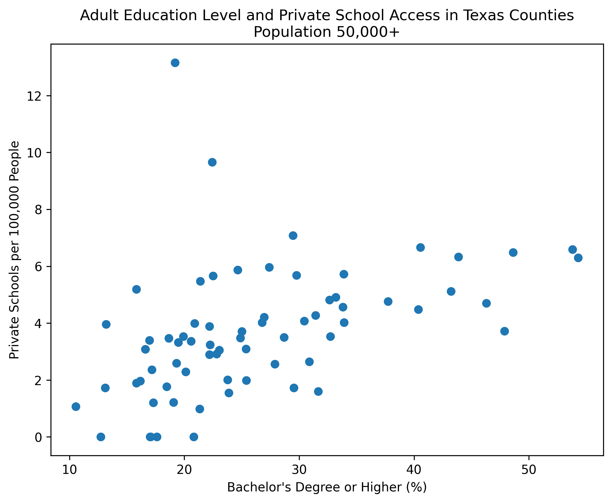
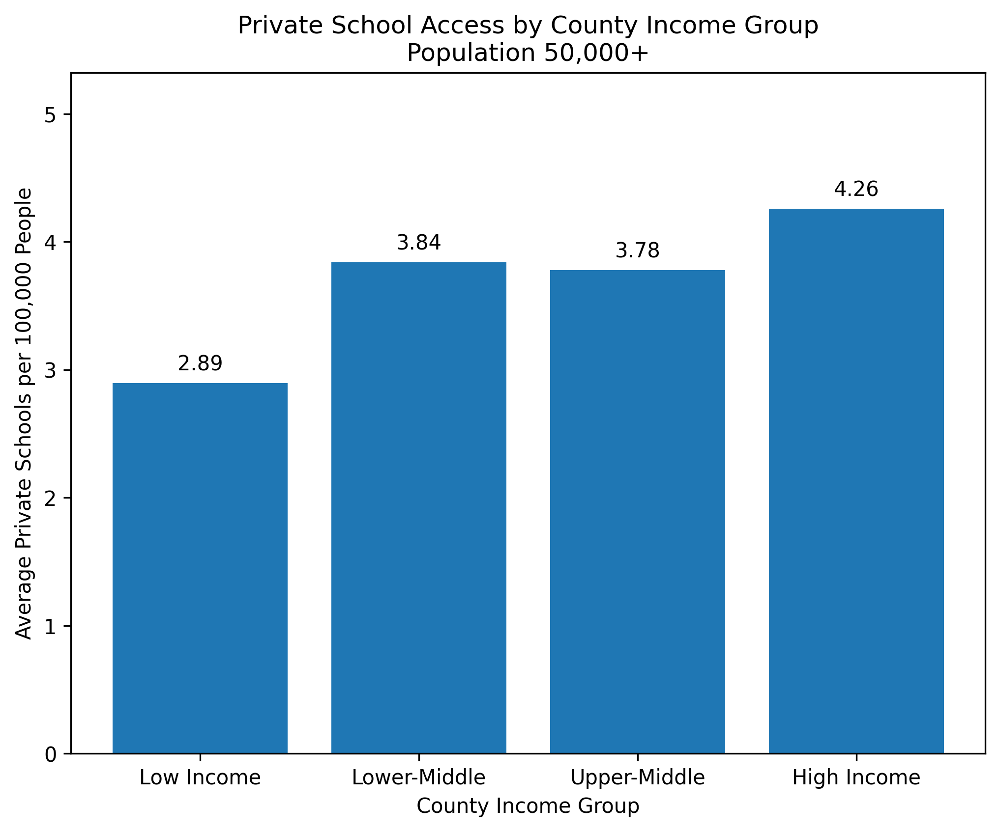
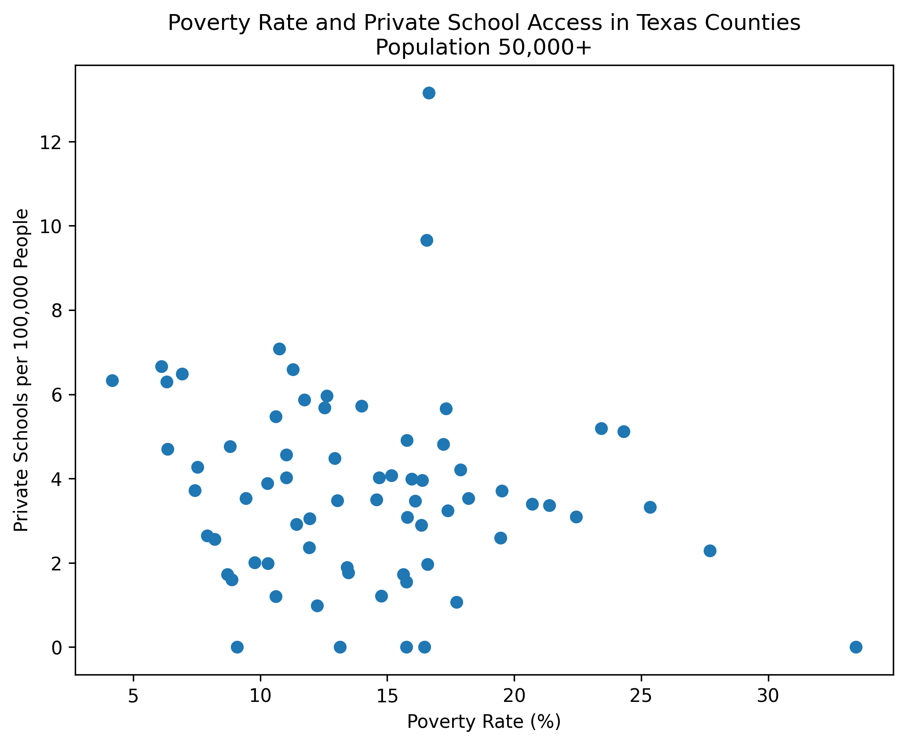
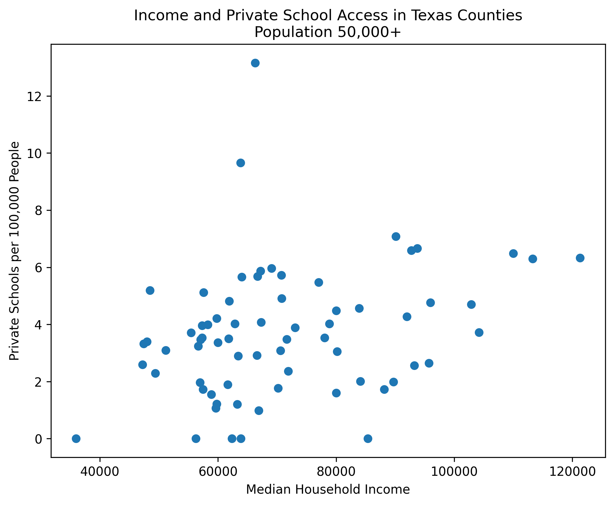
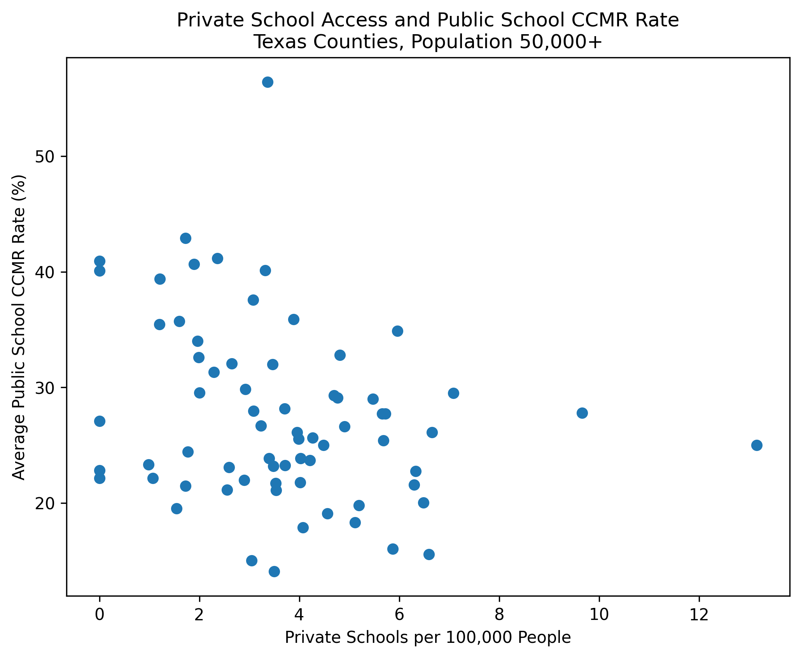
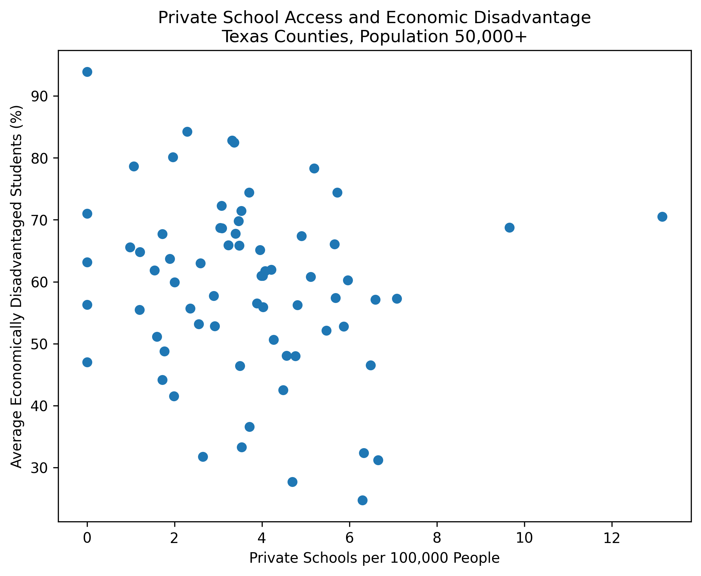
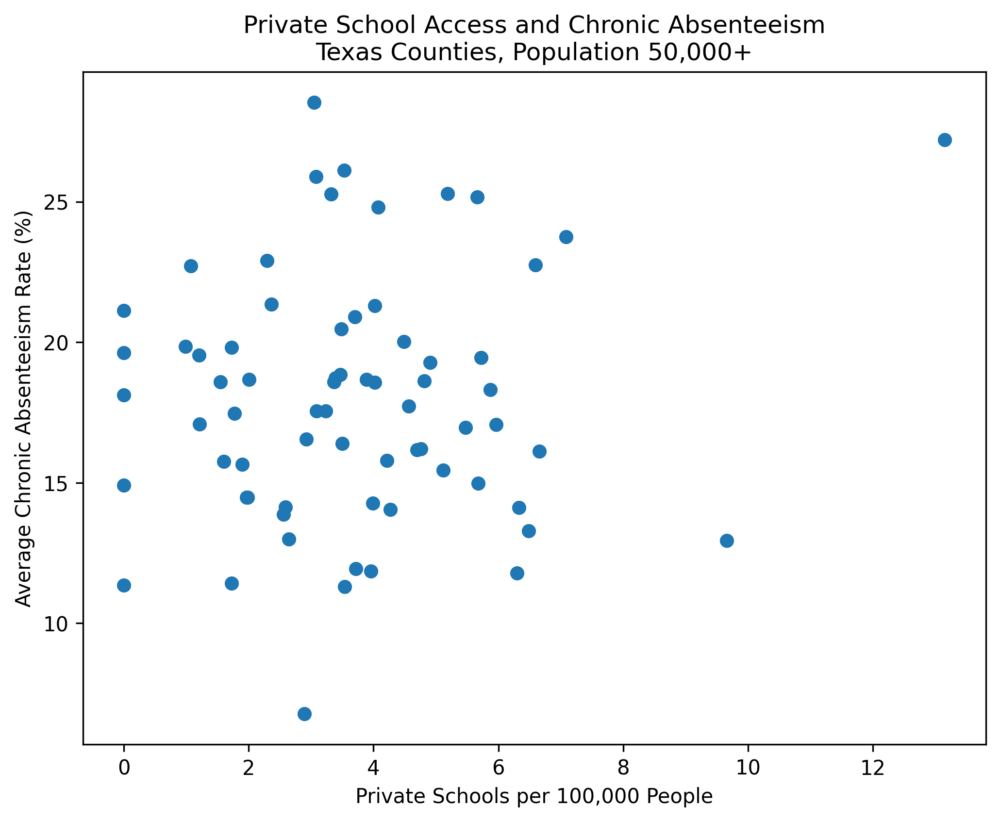

# Private School Access and Education Opportunity in Texas

## Overview

I started this project to better understand how educational opportunity varies across Texas. As a private-school student, I wanted to look beyond my own experience and use public data to study how private-school access differs across counties.

This project analyzes the relationship between private-school access, income, poverty, population, adult education level, and public-school outcomes in Texas counties.

## Final Notebook

The cleaned final analysis notebook is available here:

[View Final Analysis Notebook](notebooks/final_texas_education_analysis.ipynb)

## Project Reflection

[Read Project Reflection](report/project_reflection.md)

## Research Question

How does private-school access vary across Texas counties, and how is it related to income, poverty, and adult education level?

## Data Sources

- [NCES Private School Universe Survey](https://nces.ed.gov/surveys/pss/)
- [U.S. Census ACS 5-Year Data](https://www.census.gov/data/developers/data-sets/acs-5year.html)
- [Texas Academic Performance Reports (TAPR)](https://tea.texas.gov/texas-schools/accountability/academic-accountability/performance-reporting/texas-academic-performance-reports)
- County-level datasets created with Python and pandas

## Data Availability

The cleaned datasets used for analysis are included in `data/clean`. Raw datasets were not uploaded to keep the repository lightweight; they can be downloaded from NCES, Census ACS, and TEA TAPR using the sources listed above.

## Methods

I cleaned and combined private-school and Census county-level data, then calculated private-school access as:

> private schools per 100,000 people

I used:

- data cleaning
- county-level aggregation
- correlation analysis
- data visualization
- linear regression

## Key Findings

- Across all Texas counties, median income had almost no correlation with private-school access.
- Among counties with populations above 50,000, median income had a weak positive relationship with private-school access.
- Poverty rate had a weak negative relationship with private-school access.
- Adult education level had the strongest relationship with private-school access.
- In the regression model, bachelor's degree attainment was the only statistically significant predictor among the variables tested.

## Main Result

Private-school access in larger Texas counties appears to be more strongly associated with adult education level than with median income or poverty rate alone.

## Version 2: Public School Outcomes

I expanded this project by adding Texas Academic Performance Reports (TAPR) public-school outcome data.

This version adds county-level public-school indicators, including:

- economically disadvantaged student percentage
- attendance rate
- chronic absenteeism rate
- CCMR rate
- graduation rate

The main Version 2 question was:

> Does private-school access help explain public-school outcomes across Texas counties?

The results showed that private-school access did not meaningfully improve the model's ability to explain public-school CCMR rates after accounting for income, poverty, adult education level, economic disadvantage, and population.

Adding private-school access increased the model R-squared by only 0.012, and private-school access was not statistically significant.

[View Version 2 Notebook](notebooks/02_public_school_outcomes_analysis.ipynb)

[View Version 2 Results Summary](report/v2_results_summary.md)

## Visualizations

### Adult Education Level and Private School Access

### Private School Access by Income Group

### Poverty Rate and Private School Access

### Median Income and Private School Access

### Version 2: Private School Access and Public School CCMR

### Version 2: Private School Access and Economic Disadvantage

### Version 2: Private School Access and Chronic Absenteeism

## Tools Used

- Python
- pandas
- matplotlib
- statsmodels
- Google Colab
- GitHub

## Reproducibility Note

This notebook was developed in Google Colab. The cleaned datasets used in the analysis are included in the `data/clean` folder. The original raw NCES private-school data can be downloaded from the NCES Private School Universe Survey website.

## Limitations

This project shows association, not causation. County-level analysis can hide important differences within counties, and private-school access may also depend on factors such as religion, urbanization, local history, transportation, and family preferences.
